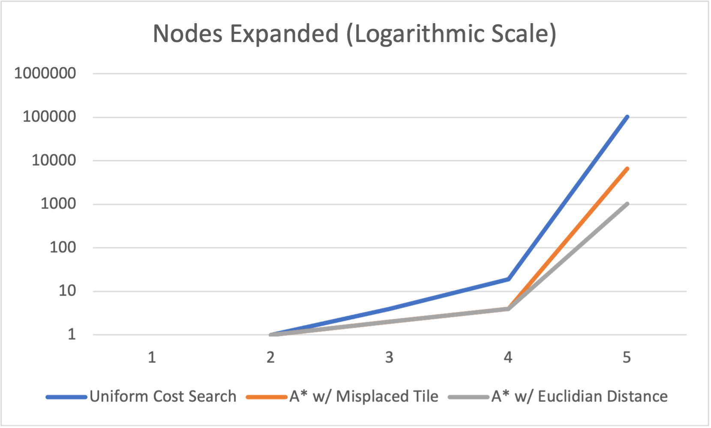
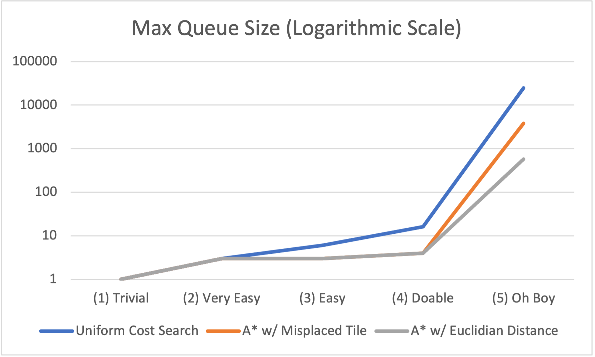

# 8-Puzzle Solver

## Introduction
8-Puzzle Solver is a command line program written in C++ to solve 8-Puzzles using the Uniform Cost Search and A* Search algorithms to navigate through the search space. This project began as an attempt to learn more about modern C++ and to further explore the impact of proper algorithm selection on a program.

The Uniform Cost Search algorithm works by expanding the node with the lowest path cost. However, in this case, since each tile movement (up, down, left, right) has the same cost it ends up working like the Breadth First Search algorithm and expands the shallowest nodes first.

The A* Search algorithm is "smarter" than the Uniform Cost Search algorithm in the sense that it uses the path cost of a node *and* an estimate of how far the node is from the goal (i.e. a heuristic) to decide which node to expand next. A really good heuristic is one that is admissible, which means that it always *underestimates* the cost to reach the goal. In this project the two heuristics that A* Search can use are the Misplaced Tile heuristic and the Euclidian Distance heuristic.

The Misplaced Tile heuristic counts the number of tiles (exluding the blank tile) that are out of place. The Euclidian Distance heuristic measures how far each tile (excluding the blank tile) is from its respective position in the goal state.

## Analysis



The two search algorithms were tested on 5 pre-configured 8-Puzzles that had varying levels of difficulty. For the 3 easiest configurations the difference between the algorithms seems very small, but once you reach the more difficult configurations we begin to see the impact that a heuristic has on the problem. In both the fourth and fifth scenario the A* Search algorithm outperforms Uniform Cost Search by a significant amount. Below are tables with the exact amounts:

|               |                     |    Nodes Expanded    |                          |
|---------------|:-------------------:|:--------------------:|:------------------------:|
|               | Uniform Cost Search | A* w/ Misplaced Tile | A* w/ Euclidian Distance |
| (1) Trivial   |          0          |           0          |             0            |
| (2) Very Easy |          1          |           1          |             1            |
| (3) Easy      |          4          |           2          |             2            |
| (4) Doable    |          19         |           4          |             4            |
| (5) Oh boy    |        103950       |         6548         |           1024           |


|               |                     |    Max Queue Size    |                          |
|---------------|:-------------------:|:--------------------:|:------------------------:|
|               | Uniform Cost Search | A* w/ Misplaced Tile | A* w/ Euclidian Distance |
| (1) Trivial   |          1          |           1          |             1            |
| (2) Very Easy |          3          |           3          |             3            |
| (3) Easy      |          6          |           3          |             3            |
| (4) Doable    |          16         |           4          |             4            |
| (5) Oh boy    |        24980        |         3777         |            573           |

## Installation
Clone this repository to your local machine.
```
$ git clone <this-repo-url>
```
Change directory to where the source files are located and `make` the project.
```
$ cd 8Puzzle

$ make
```
Run the executable `puzzle`.
```
$ ./puzzle
```
Lastly, just follow the on-screen instructions! Enjoy!

## Reflections:
I really enjoyed working on this project because I was able to learn more about these two search algorithms and dive into some new C++ features (new to me at least 😅).

Diving into smart pointers was by far the best part of this project. When I first took an introductory C++ class we were introduced to the usual method of using `new` to create a raw pointer and then having to clean-up after it using `delete`. This was always very tedious when I compared it to a language like Java where you can rely on the garbage collector. I know there are still cases where one might need to use `new` and `delete`, but smart pointers really help a lot. Reading about smart pointers also introduced me to move semantics, which is a really neat concept!

I had a minor setback when I tried using a priority queue as my frontier (open list). The idea was I would use a priority queue so I can have fast look-up time when I need to access the cheapest node, but I also had to be able to iterate through it and priority queues in C++ are not iterable. To fix this, I chose to use a vector and emulate a priority queue. Sorting the vector in descending order and then using `back()` would give me a similar effect. Removing that element was also easy because of `pop_back()`.

## Acknowledgements:

I found myself reading a lot throughout this project so here are some of the articles I received help from.

*   [C++ Reference](https://en.cppreference.com/w/)
*   [shared_ptr in priority_queue: how to make it work ](https://comp.lang.cpp.moderated.narkive.com/SlsEKFxD/shared-ptr-in-priority-queue-how-to-make-it-work)
*   [Priority queue for user-defined types](https://stackoverflow.com/questions/9178083/priority-queue-for-user-defined-types)
*   [Functors in C++](https://www.geeksforgeeks.org/functors-in-cpp/)
*   [How to check if an instance of 8 puzzle is solvable?](https://www.geeksforgeeks.org/check-instance-8-puzzle-solvable/)
*   [C++ rvalue references and move semantics for beginners](https://www.internalpointers.com/post/c-rvalue-references-and-move-semantics-beginners)
*   [A beginner's look at smart pointers in modern C++](https://www.internalpointers.com/post/beginner-s-look-smart-pointers-modern-c)
*   [Microsoft -  Smart pointers (Modern C++)](https://docs.microsoft.com/en-us/cpp/cpp/smart-pointers-modern-cpp)
*   [Move smart pointers in and out functions in modern C++](https://www.internalpointers.com/post/move-smart-pointers-and-out-functions-modern-c)
*   [Google C++ Style Guide](https://google.github.io/styleguide/cppguide.html)